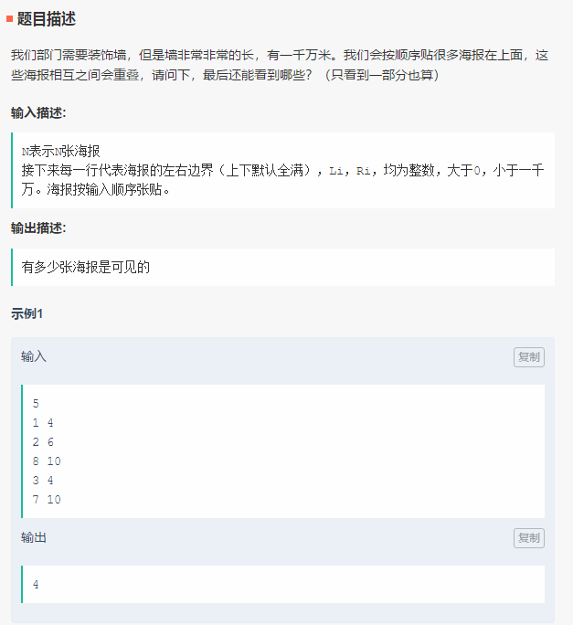
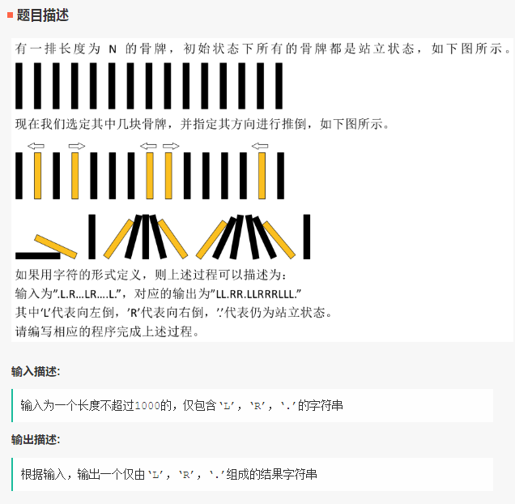
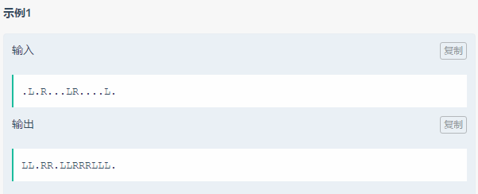

# 招行

15道单选、5道多选、3道问答、2道编程

## Index

* [重叠的装饰](bi-shi-zhao-hang-180830.md#重叠的装饰)
* [推倒吧骨牌](bi-shi-zhao-hang-180830.md#推倒吧骨牌)

## 重叠的装饰

**题目描述** 

**思路**

* 线段树

  > [统计颜色（线段树区间修改问题）](https://blog.csdn.net/bao___zi/article/details/80154839) - CSDN博客

## 推倒吧骨牌

> LeetCode 原题：[https://leetcode-cn.com/problems/push-dominoes/description/](https://leetcode-cn.com/problems/push-dominoes/description/)
>
> > **题解**：../算法/LeetCode题解/[838. 推多米诺](https://github.com/FantasyJXF/Artificial-Intelligence/tree/9859473754e144ed8a6da363c7c773ac65a7a1a6/算法/题解-LeetCode.md#838-推多米诺)  

