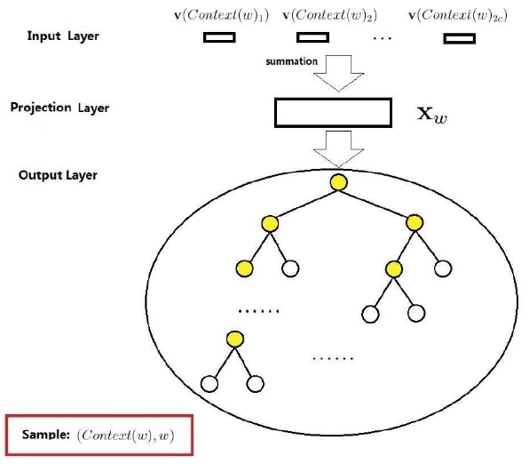
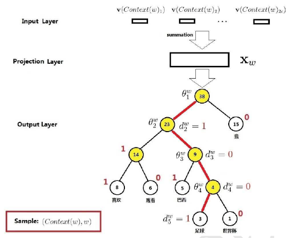
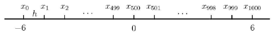
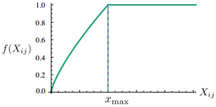

# 词向量

## NLP-词向量

### Index

* [背景知识](b-zhuan-ti-ci-xiang-liang.md#背景知识)
  * [神经语言模型](b-zhuan-ti-ci-xiang-liang.md#神经语言模型)
  * [什么是词向量/词嵌入](b-zhuan-ti-ci-xiang-liang.md#什么是词向量词嵌入)
  * [词向量的理解 TODO](b-zhuan-ti-ci-xiang-liang.md#词向量的理解-todo)
* [Word2Vec](b-zhuan-ti-ci-xiang-liang.md#word2vec)
  * [基于层次 SoftMax 的 CBOW 模型](b-zhuan-ti-ci-xiang-liang.md#基于层次-softmax-的-cbow-模型)
    * [层次 SoftMax 的正向传播](b-zhuan-ti-ci-xiang-liang.md#层次-softmax-的正向传播)
      * [为什么层次 SoftMax 能加速](b-zhuan-ti-ci-xiang-liang.md#为什么层次-softmax-能加速)
    * [层次 Softmax 的反向传播 TODO](b-zhuan-ti-ci-xiang-liang.md#层次-softmax-的反向传播-todo)
  * [基于层次 Softmax 的 Skip-gram 模型](b-zhuan-ti-ci-xiang-liang.md#基于层次-softmax-的-skip-gram-模型)
  * [---](b-zhuan-ti-ci-xiang-liang.md#---)
  * [基于负采样的 CBOW 和 Skip-gram](b-zhuan-ti-ci-xiang-liang.md#基于负采样的-cbow-和-skip-gram)
  * [负采样算法](b-zhuan-ti-ci-xiang-liang.md#负采样算法)
    * [Word2Vec 中的做法](b-zhuan-ti-ci-xiang-liang.md#word2vec-中的做法)
  * [一些源码细节](b-zhuan-ti-ci-xiang-liang.md#一些源码细节)
    * [`σ(x)` 的近似计算](b-zhuan-ti-ci-xiang-liang.md#σx-的近似计算)
    * [低频词的处理](b-zhuan-ti-ci-xiang-liang.md#低频词的处理)
    * [高频词的处理](b-zhuan-ti-ci-xiang-liang.md#高频词的处理)
    * [自适应学习率](b-zhuan-ti-ci-xiang-liang.md#自适应学习率)
    * [参数初始化](b-zhuan-ti-ci-xiang-liang.md#参数初始化)
* [GloVe](b-zhuan-ti-ci-xiang-liang.md#glove)
  * [共现矩阵](b-zhuan-ti-ci-xiang-liang.md#共现矩阵)
    * [构架共现矩阵的细节](b-zhuan-ti-ci-xiang-liang.md#构架共现矩阵的细节)
  * [GloVe 的基本思想](b-zhuan-ti-ci-xiang-liang.md#glove-的基本思想)
  * [GloVe 的目标函数](b-zhuan-ti-ci-xiang-liang.md#glove-的目标函数)
    * [GloVe 目标函数的推导过程](b-zhuan-ti-ci-xiang-liang.md#glove-目标函数的推导过程)
  * [GloVe 与 Word2Vec 的区别](b-zhuan-ti-ci-xiang-liang.md#glove-与-word2vec-的区别)
* [FastText](b-zhuan-ti-ci-xiang-liang.md#fasttext)
  * [`gensim.models.FastText` 使用示例](b-zhuan-ti-ci-xiang-liang.md#gensimmodelsfasttext-使用示例)
    * [获取单个词的 ngrams 表示](b-zhuan-ti-ci-xiang-liang.md#获取单个词的-ngrams-表示)
    * [计算一个未登录词的词向量](b-zhuan-ti-ci-xiang-liang.md#计算一个未登录词的词向量)
* [WordRank TODO](b-zhuan-ti-ci-xiang-liang.md#wordrank-todo)
* [CharCNN 字向量](b-zhuan-ti-ci-xiang-liang.md#charcnn-字向量)
* [其他实践](b-zhuan-ti-ci-xiang-liang.md#其他实践)
  * [一般 embedding 维度的选择](b-zhuan-ti-ci-xiang-liang.md#一般-embedding-维度的选择)

## 背景知识

### 神经语言模型

> [神经语言模型](https://github.com/FantasyJXF/Artificial-Intelligence/tree/ff40df9ea2a4579767c0a29baed45c578389cd4e/B-自然语言处理/A-自然语言处理基础/README.md#神经概率语言模型-nplm)

### 什么是词向量/词嵌入

* 词向量（word embedding）是一个固定长度的实值向量
* 词向量是神经语言模型的**副产品**。
* 词向量是针对“词”提出的。事实上，也可以针对更细或更粗的粒度来进行推广——比如字向量、句向量、文档向量等

### 词向量的理解 TODO

> [word2vec 中的数学原理详解（三）背景知识](https://blog.csdn.net/itplus/article/details/37969817) - CSDN博客
>
> * 在 NLP 任务中，因为机器无法直接理解自然语言，所以首先要做的就是将语言**数学化**——词向量就是一种将自然语言数学化的方法。

**One-hot 表示**

* TODO

**分布式表示** \(distributed representation\)

* 分布式假设
* TODO
* 常见的分布式表示方法
  * 潜在语义分析 \(Latent Semantic Analysis, LSA\)
    * SVD 分解
  * 隐含狄利克雷分布 \(Latent Dirichlet Allocation, LDA\)，主题模型
  * 神经网络、深度学习

## Word2Vec

* Word2Vec 本质上也是一个神经语言模型，但是它的目标并不是语言模型本身，而是词向量；因此，其所作的一系列优化，都是为了更快更好的得到词向量
* Word2Vec 提供了两套模型：**CBOW** 和 **Skip-Gram**\(SG\)
  * CBOW 在已知 `context(w)` 的情况下，预测 `w`
  * SG 在已知 `w` 的情况下预测 `context(w)`
* 从训练集的构建方式可以更好的理解和区别 **CBOW** 和 **SG** 模型
  * 每个训练样本为一个二元组 `(x, y)`，其中 `x`为特征，`y`为标签

    假设上下文窗口的大小 `context_window =5`，即 

    或者说 `skip_window = 2`，有 `context_window = skip_window*2 + 1`

  * CBOW 的训练样本为： 
  * SG 的训练样本为： 
  * 一般来说，`skip_window <= 10`
* 除了两套模型，Word2Vec 还提供了两套优化方案，分别基于 Hierarchical Softmax \(层次SoftMax\) 和 Negative Sampling \(负采样\)

### 基于层次 SoftMax 的 CBOW 模型

* 【**输入层**】将 `context(w)` 中的词映射为 `m` 维词向量，共 `2c` 个
* 【**投影层**】将输入层的 `2c` 个词向量累加求和，得到新的 `m` 维词向量
* 【**输出层**】输出层对应一棵**哈夫曼树**，以词表中词作为叶子节点，各词的出现频率作为权重——共 `N` 个叶子节点，`N-1` 个非叶子节点 
* 对比 [N-gram 神经语言模型的网络结构](b-zhuan-ti-ci-xiang-liang.md#n-gram-神经语言模型的网络结构)
  * 【输入层】前者使用的是 `w` 的前 `n-1` 个词，后者使用 `w` 两边的词

    > 这是后者词向量的性能优于前者的主要原因

  * 【投影层】前者通过拼接，后者通过**累加求和**
  * 【隐藏层】后者无隐藏层
  * 【输出层】前者为线性结构，后者为树形结构
* 模型改进
  * 从对比中可以看出，CBOW 模型的主要改进都是为了**减少计算量**——取消隐藏层、使用**层Softmax**代替基本Softmax

#### 层次 SoftMax 的正向传播

* 层 Softmax 实际上是把一个超大的多分类问题转化成一系列二分类问题
* 示例：求 `P("足球"|context("足球"))` 
  * 从根节点到“足球”所在的叶子节点，需要经过 4 个分支，每次分支相当于一次**二分类**（逻辑斯蒂回归，二元Softmax） 

    > 这里遵从原文，将 0 作为正类，1 作为负类

  * 而 `P("足球"|context("足球"))` 就是每次分类正确的概率之积，即 

    > 这里每个非叶子都对应一个参数 `θ_i`

**为什么层次 SoftMax 能加速**

* Softmax 大部分的计算量在于分母部分，它需要求出所有分量的和
* 而层次 SoftMax 每次只需要计算两个分量，因此极大的提升了速度

#### 层次 Softmax 的反向传播 TODO

> [word2vec 中的数学原理详解（四）基于 Hierarchical Softmax 的模型](https://blog.csdn.net/itplus/article/details/37969979) - CSDN博客

### 基于层次 Softmax 的 Skip-gram 模型

* 这里保留了【投影层】，但实际上只是一个恒等变换 
* 从模型的角度看：CBOW 与 SG 模型的区别仅在于 `x_w` 的构造方式不同，前者是 `context(w)` 的词向量累加；后者就是 `w` 的词向量
* 虽然 SG 模型用中心词做特征，上下文词做类标，但实际上两者的地位是等价的

### ---

### 基于负采样的 CBOW 和 Skip-gram

* 层次 Softmax 还不够简单，于是提出了基于负采样的方法进一步提升性能
* 负采样（Negative Sampling）是 NCE\(Noise Contrastive Estimation\) 的简化版本

  > [噪音对比估计（NCE）](https://blog.csdn.net/littlely_ll/article/details/79252064) - CSDN博客

* CBOW 的训练样本是一个 `(context(w), w)` 二元对；对于给定的 `context(w)`，`w` 就是它的正样本，而其他所有词都是负样本。
* 如果不使用**负采样**，即 N-gram 神经语言模型中的做法，就是对整个词表 Softmax 和交叉熵
* 负采样相当于选取所有负例中的一部分作为负样本，从而减少计算量
* Skip-gram 模型同理

### 负采样算法

* 负采样算法，即对给定的 `w` ，生成相应负样本的方法
* 最简单的方法是随机采样，但这会产生一点问题，词表中的词出现频率并不相同
  * 如果不是从词表中采样，而是从语料中采样；显然，那些高频词被选为负样本的概率要大于低频词
  * 在词表中采样时也应该遵循这个
* 因此，负采样算法实际上就是一个**带权采样**过程

#### Word2Vec 中的做法

* 记 
* 以这 `N+1` 个点对区间 `[0,1]` 做非等距切分
* 引入的一个在区间 `[0,1]` 上的 `M` 等距切分，其中 `M >> N` 

  > 源码中取 `M = 10^8`

* 然后对两个切分做投影，得到映射关系 
* 采样时，每次生成一个 `[1, M-1]` 之间的整数 `i`，则 `Table(i)` 就对应一个样本；当采样到正例时，跳过（**拒绝采样**）。
* 特别的，Word2Vec 在计算 `len(w)` 时做了一些改动——为 `count(·)` 加了一个**指数** 

### 一些源码细节

#### `σ(x)` 的近似计算

* 类似带权采样的策略，用**查表**来代替计算 
* 具体计算公式如下 

  > 因为 `σ(x)` 函数的饱和性，当 `x < -6 || x > 6` 时，函数值基本不变了

#### 低频词的处理

* 对于低频词，会设置阈值（默认 5），对于出现频次低于该阈值的词会直接舍弃，同时训练集中也会被删除

#### 高频词的处理

* 高频词提供的信息相对较少，为了提高低频词的词向量质量，有必要对高频词进行限制
* 高频词对应的词向量在训练时，不会发生明显的变化，因此在训练是可以减少对这些词的训练，从而提升速度

**Sub-sampling 技巧**

* 源码中使用 Sub-sampling 技巧来解决高频词的问题，能带来 2~10 倍的训练速度提升，同时提高低频词的词向量精度
* 给定一个词频阈值 `t`，将 `w` 以 `p(w)` 的概率舍弃，`p(w)` 的计算如下

**Word2Vec 中的Sub-sampling**

* 显然，Sub-Sampling 只会针对 出现频次大于 `t` 的词
* 特别的，Word2Vec 使用如下公式计算 `p(w)`，效果是类似的

#### 自适应学习率

* 预先设置一个初始的学习率 `η_0`（默认 0.025），每处理完 `M`（默认 10000）个词，就根据以下公式调整学习率 
* 随着训练的进行，学习率会主键减小，并趋向于 0
* 为了方式学习率过小，Word2Vec 设置了一个阈值 `η_min`（默认 `0.0001 * η_0`）；当学习率小于 `η_min`，则固定为 `η_min`。

#### 参数初始化

* 词向量服从均匀分布 `[-0.5/m, 0.5/m]`，其中 `m` 为词向量的维度
* 所有网络参数初始化为 `0`

## GloVe

> CS224d - L2&3-词向量

### 共现矩阵

* 共现矩阵的实现方式
  * 基于文档 - LSA 模型（SVD分解）
  * 基于窗口 - 类似 skip-gram 模型中的方法 

    > `skip_window = 1` 的共现矩阵

#### 构架共现矩阵的细节

* **功能词的处理**
  * 功能词：如 "the", "he", "has", ...
  * **法1**）直接忽略
    * 在一些分类问题上可以这么做；如果目标是词向量，则不建议使用这种方法
  * **法2**）设置阈值 `min(x, t)`
    * 其中 `x` 为功能词语其他词的共现次数，`t` 为设置的阈值
* 可以尝试使用一些方法代替单纯的计数，如**皮尔逊相关系数**，负数记为 0

  > 但是似乎没有人这么做

### GloVe 的基本思想

* GloVe 模型的是基于**共现矩阵**构建的
* GloVe 认为共现矩阵可以通过一些统计信息得到词之间的关系，这些关系可以一定程度上表达词的含义 
  * **solid** related to **ice** but not **steam**
  * **gas** related to **stream** but not **ice**
  * **water** related to both
  * **fashion** relate not to both

    > 说明 TODO
* GloVe 的基本思想：
  * 假设词向量已知，如果这些词向量通过**某个函数**（目标函数）可以**拟合**共现矩阵中的统计信息，那么可以认为这些词向量也拥有了共现矩阵中蕴含的语义
  * 模型的训练过程就是拟合词向量的过程

### GloVe 的目标函数

其中

* `w_i` 和 `w_j` 为词向量
* `x_ij` 为 `w_i` 和 `w_j` 的共现次数
* `f(x)` 是一个权重函数，为了限制高频词和防止 `x_ij = 0` 
  * 当 `x_ij = 0` 时，有

#### GloVe 目标函数的推导过程

> 以前整理在 OneNote 上的，有时间在整理
>
> * 目标函数

* `w_i` 的权重函数

### GloVe 与 Word2Vec 的区别

* Word2Vec 本质上是一个神经网络；  


  Glove 也利用了**反向传播**来更新词向量，但是结构要更简单，所以 GloVe 的速度更快

* Glove 认为 Word2Vec 对高频词的处理还不够，导致速度慢；GloVe 认为共现矩阵可以解决这个问题

  > 实际 Word2Vec 已结有了一些对高频词的措施 &gt; [高频词的处理](b-zhuan-ti-ci-xiang-liang.md#高频词的处理)

* 从效果上看，虽然 GloVe 的训练速度更快，但是**词向量的性能**在通用性上要弱一些： 在一些任务上表现优于 Word2Vec，但是在更多的任务上要比 Word2Vec 差

## FastText

* FastText 是从 Word2Vec 的 CBOW 模型演化而来的；

  从网络的角度来看，两者的模型基本一致；**区别仅在于两者的输入和目标函数不同**；

  > [基于层次 SoftMax 的 CBOW 模型](b-zhuan-ti-ci-xiang-liang.md#基于层次-softmax-的-cbow-模型)

* FastText 与 CBOW 的相同点：
  * 包含三层：输入层、隐含层、输出层（Hierarchical Softmax）
  * 输入都是多个单词的词向量
  * 隐藏层（投影层）都是对多个词向量的叠加平均
  * 输出都是一个特定的 target
  * 从网络的角度看，两者基本一致
* 不同点：
  * CBOW 的输入是中心词两侧`skip_window`内的上下文词；FastText 除了上下文词外，还包括这些词的字符级 **N-gram 特征**
* **注意**，字符级 N-gram 只限制在单个词内，以英文为例

  ```cpp
    // 源码中计算 n-grams 的声明，只计算单个词的字符级 n-gram
    compute_ngrams(word, unsigned int min_n, unsigned int max_n);
  ```

  ```python
    # > https://github.com/vrasneur/pyfasttext#get-the-subwords
    >>> model.args.get('minn'), model.args.get('maxn')
    (2, 4)
    # 调用源码的 Python 接口，源码上也会添加 '<' 和 '>'
    >>> model.get_all_subwords('hello') # word + subwords from 2 to 4 characters
    ['hello', '<h', '<he', '<hel', 'he', 'hel', 'hell', 'el', 'ell', 'ello', 'll', 'llo', 'llo>', 'lo', 'lo>', 'o>']
    >>> # model.get_all_subwords('hello world')  # warning
  ```

* **值得一提的是**，因为 FastText 使用了字符级的 N-gram 向量作为额外的特征，使其能够对**未登录词**也能输出相应的词向量；

  **具体来说**，**未登录词**的词向量等于其 N-gram 向量的叠加

### `gensim.models.FastText` 使用示例

> ../codes/[FastText](https://github.com/FantasyJXF/Artificial-Intelligence/tree/ff40df9ea2a4579767c0a29baed45c578389cd4e/_codes/工具库/gensim/FastText.py)

* 构建 FastText 以及获取词向量

  ```python
    # gensim 示例
    import gensim
    import numpy as np
    from gensim.test.utils import common_texts
    from gensim.models.keyedvectors import FastTextKeyedVectors
    from gensim.models._utils_any2vec import compute_ngrams, ft_hash
    from gensim.models import FastText

    # 构建 FastText 模型
    sentences = [["Hello", "World", "!"], ["I", "am", "huay", "."]]
    min_ngrams, max_ngrams = 2, 4  # ngrams 范围
    model = FastText(sentences, size=5, min_count=1, min_n=min_ngrams, max_n=max_ngrams)

    # 可以通过相同的方式获取每个单词以及任一个 n-gram 的向量
    print(model.wv['hello'])
    print(model.wv['<h'])
    """
    [-0.03481839  0.00606661  0.02581969  0.00188777  0.0325358 ]
    [ 0.04481247 -0.1784363  -0.03192253  0.07162753  0.16744071]
    """
    print()

    # 词向量和 n-gram 向量是分开存储的
    print(len(model.wv.vectors))  # 7
    print(len(model.wv.vectors_ngrams))  # 57
    # gensim 好像没有提供直接获取所有 ngrams tokens 的方法

    print(model.wv.vocab.keys())
    """
    ['Hello', 'World', '!', 'I', 'am', 'huay', '.']
    """
    print()
  ```

#### 获取单个词的 ngrams 表示

* 利用源码中 `compute_ngrams` 方法，gensim 提供了该方法的 Python 接口

  ```python
    sum_ngrams = 0
    for s in sentences:
        for w in s:
            w = w.lower()
            # from gensim.models._utils_any2vec import compute_ngrams
            ret = compute_ngrams(w, min_ngrams, max_ngrams)  
            print(ret)
            sum_ngrams += len(ret)
    """
    ['<h', 'he', 'el', 'll', 'lo', 'o>', '<he', 'hel', 'ell', 'llo', 'lo>', '<hel', 'hell', 'ello', 'llo>']
    ['<w', 'wo', 'or', 'rl', 'ld', 'd>', '<wo', 'wor', 'orl', 'rld', 'ld>', '<wor', 'worl', 'orld', 'rld>']
    ['<!', '!>', '<!>']
    ['<i', 'i>', '<i>']
    ['<a', 'am', 'm>', '<am', 'am>', '<am>']
    ['<h', 'hu', 'ua', 'ay', 'y>', '<hu', 'hua', 'uay', 'ay>', '<hua', 'huay', 'uay>']
    ['<.', '.>', '<.>']
    """
    assert sum_ngrams == len(model.wv.vectors_ngrams)
    print(sum_ngrams)  # 57
    print()
  ```

#### 计算一个未登录词的词向量

* 未登录词实际上是已知 n-grams 向量的叠加平均

  ```python
    # 因为 "a", "aa", "aaa" 中都只含有 "<a" ，所以它们实际上都是 "<a"
    print(model.wv["a"])
    print(model.wv["aa"])
    print(model.wv["aaa"])
    print(model.wv["<a"])  
    """
    [ 0.00226487 -0.19139008  0.17918809  0.13084619 -0.1939924 ]
    [ 0.00226487 -0.19139008  0.17918809  0.13084619 -0.1939924 ]
    [ 0.00226487 -0.19139008  0.17918809  0.13084619 -0.1939924 ]
    [ 0.00226487 -0.19139008  0.17918809  0.13084619 -0.1939924 ]
    """
    print()
  ```

* 只要未登录词能被已知的 n-grams 组合，就能得到该词的词向量

  > `gensim.models.keyedvectors.FastTextKeyedVectors.word_vec(token)` 的内部实现
  >
  > \`\`\`Python word\_unk = "aam" ngrams = compute\_ngrams\(word\_unk, min\_ngrams, max\_ngrams\) \# min\_ngrams, max\_ngrams = 2, 4 word\_vec = np.zeros\(model.vector\_size, dtype=np.float32\) ngrams\_found = 0 for ngram in ngrams: ngram\_hash = ft\_hash\(ngram\) % model.bucket if ngram\_hash in model.wv.hash2index: word\_vec += model.wv.vectors\_ngrams\[model.wv.hash2index\[ngram\_hash\]\] ngrams\_found += 1

  if word\_vec.any\(\): \# word\_vec = word\_vec / max\(1, ngrams\_found\) else: \# 如果一个 ngram 都没找到，gensim 会报错；个人认为把 0 向量传出来也可以 raise KeyError\('all ngrams for word %s absent from model' % word\_unk\)

  print\(word\_vec\) print\(model.wv\["aam"\]\) """ \[ 0.02210762 -0.10488641 0.05512805 0.09150169 0.00725085\] \[ 0.02210762 -0.10488641 0.05512805 0.09150169 0.00725085\] """

  **如果一个 ngram 都没找到，gensim 会报错**

  **其实可以返回一个 0 向量的，它内部实际上是从一个 0 向量开始累加的；**

  **但返回时做了一个判断——如果依然是 0 向量，则报错**

  **print\(model.wv\['z'\]\)**

  """ Traceback \(most recent call last\): File "D:/OneDrive/workspace/github/DL-Notes-for-Interview/code/工具库 /gensim/FastText.py", line 53, in  print\(model.wv\['z'\]\) File "D:\program\work\Python\Anaconda3\envs\tf\lib\site-packages\gensim\models \keyedvectors.py", line 336, in **getitem** return self.get\_vector\(entities\) File "D:\program\work\Python\Anaconda3\envs\tf\lib\site-packages\gensim\models \keyedvectors.py", line 454, in get\_vector return self.word\_vec\(word\) File "D:\program\work\Python\Anaconda3\envs\tf\lib\site-packages\gensim\models \keyedvectors.py", line 1989, in word\_vec raise KeyError\('all ngrams for word %s absent from model' % word\) KeyError: 'all ngrams for word z absent from model' """

  \`\`\`

## WordRank TODO

## CharCNN 字向量

* CharCNN 的思想是通过字符向量得到词向量

> \[1509\] [Character-level Convolutional Networks for Text Classification](https://arxiv.org/abs/1509.01626)

## 其他实践

### 一般 embedding 维度的选择

> [Feature Columns](https://www.tensorflow.org/versions/master/guide/feature_columns#indicator_and_embedding_columns) \| TensorFlow
>
> * 经验公式 `embedding_size = n_categories ** 0.25`
> * 在大型语料上训练的词向量维度通常会设置的更大一些，比如 `100~300`
>
>   如果根据经验公式，是不需要这么大的，比如 200W 词表的词向量维度只需要 `200W ** 0.25 ≈ 37`

